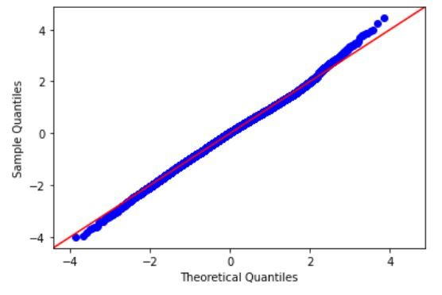
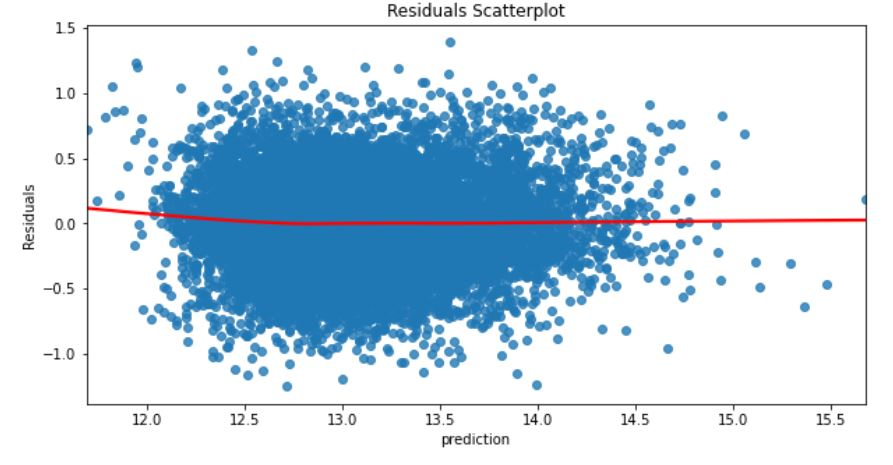

# House Price Linear Regression

**Authors**: Ricky Wong

## Overview

Jim's Real Estate wants to help homeowners make the most of their property and would like to know how renovations affect house prices. Using linear regression we found two variables that affected house prices the most. Using that information, real estate agents can provide meaningful advice for homeowners.

## Business Understanding

There are a variety of variables when determining the value of a property. Creating a model for real estate agents will help them advise homewoeners about how renovating affects the value of their property. To do this we will explore house data from King County to build a basic model then reiterate the process to improve on the model.  

## Data Understanding

We have obtained house data from King County to help us build the model. This includes useful information like the price of the property, the living area in square feet and the year the poroprty was renovated to name a few.<br />
After getting an idea of the data we are dealing with we can see most of our data are numerical with some columns missing data like 'waterfront' and 'yr_renovated'. We will need to clean those up later<br />
There are some data which is not really relevant to our model which we can remove.<br /> 
Taking a closer look we can observe a few points
- A possible outlier with 33 bedrooms when the mean is only 3.
- Condition of the house is form 1-5
- There is a grading system from 3 - 13
- And house data from 1900 - 2015
- sqft_basement has '?' which could explain why it is an object instead of being numeric

#### Continuous Data
The histograms show the data being positively skewed. We will need to run log transformations to make them more normal.

#### Categorical Data
The house with 33 bedrooms is an outlier which we can drop when cleaning <br />
We can see there wasn't many renovations happening (less than 10) until after 1982 <br />
Knowing if the property has been renovated or not would be more useful than the year the property was renovated 


## Data Preparation

We remove rows with null values in 'yr_renovated' as we don't know if they have been renovated or not. <br />
We will also remove basement values that are not numbers. We still have plenty of data to use from removing them. <br />
Remove the outlier in bedrooms

#### Check for Multicollinearity
Variables that are highly correlated to another variable will cause problems for our regression analysis. Making the results unreliable. To fix that we look for highly correlated variables and remove some. <br />
We removed 'sqft_basement' and 'bathrooms'

#### Normalise
Our data is positively skewed so we need to do log transformation to make it have a more normal distribution.
After that we need to standardise our data making the mean 0

#### One Hot Encode
For linear regression, categorical data should be transformed using one-hot encoding.
In order to not have so many predictors for the year built we categorised them into 5 year increments.

## Modeling

#### Model 1
Our first model used all the available predictors and got an R-Squared value of 0.633 which is reasonable, being able to explain 63% of variations of our model. <br />
std_above and conditions had p-values greater than 0.05 so we will remove those for the next model.

#### Model 2
Removing the two predictors have lowered our R-Squared score slightly <br />
Skew and Kurtosis is still quite high <br />
Doing a QQ-plot shows it is not normal so we run log transformation on price as well.

#### Model 3
After log transformation on price we can see if has improved the distribution to be more normal<br />
Improved Skewness from highly positive skew to slightly negative skew. Improved skew which is now between -0.5 and 0.5  meaning the data is pretty symmetrical as shown in the QQ-plot below <br />
R-Squared value has also increased to 0.646 meaning 64.6% of the variance is explained by the model.<br />


#### Homoscedasticity
Scatterplot to show homoscedasticity. No cone like pattern.


#### Training
With training and test MSE being similar, we can expect the model to perform similarly on different data.<br />
Accuracy of the model is 63.42


## Conclusions
With our final model the OLS regression results tell us that the R-Squared value is 0.646 meaning 64.6% of the variance can be explained by the model. The results also tells us the skewness is -0.039 which is between -0.5 to 0.5 meaning the data is symmetrical, satisfying the normality assumption. This can also be seen from the QQ-plot with points mostly following the line. If we observed a QQ-plot like in model 2 then the distribution would be non-normal. Another assumption for linear regression is that data must be homoscedastic. To check this we created a scatterplot and did not observe any cone like shapes which would indicated the data is heteroscedastic.<br />
The living space of a property has the strongest relationship with house prices. This is determined by the t value of 49.874 which tells us how statistically significant the coefficient is. This makes sense as we spend most of the time inside the house and having a larger living area generally means more rooms or floors making it appealing to buyers. Floor had the next highest t value of 11.1 but only for 3 floors. Having more floors generally means more living area which can increase the value. Grades are also significant as it represents the quality of the home. Renovated has a t value of 2.7 which is not as high. This might be because the data for unrenovated homes heavily outweighed that of renovated homes. 


## For More Information

Please review our full analysis in [our Jupyter Notebook](./House Price.ipynb) or our [presentation](./presentation.pdf).

For any additional questions, please contact ** Ricky wong_ricky@hotmail.com**

## Repository Structure


```
├── README.md                           <- The top-level README for reviewers of this project
├── House Price.ipynb                   <- Narrative documentation of analysis in Jupyter notebook
├── notebook.pdf                        <- PDF version of notebook
├── presentation.pdf                    <- PDF version of project presentation
├── github.pdf                          <- PDF version of github  
├── data                                <- Both sourced externally and generated from code
└── images                              <- Both sourced externally and generated from code
```
